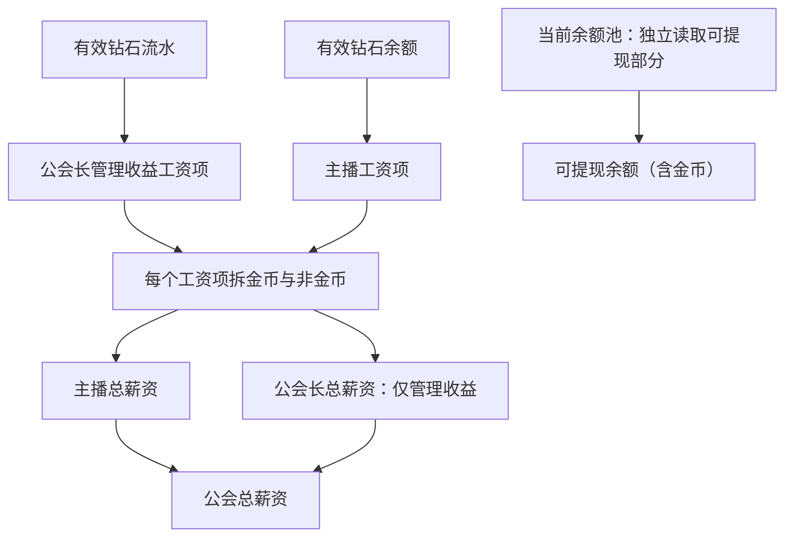
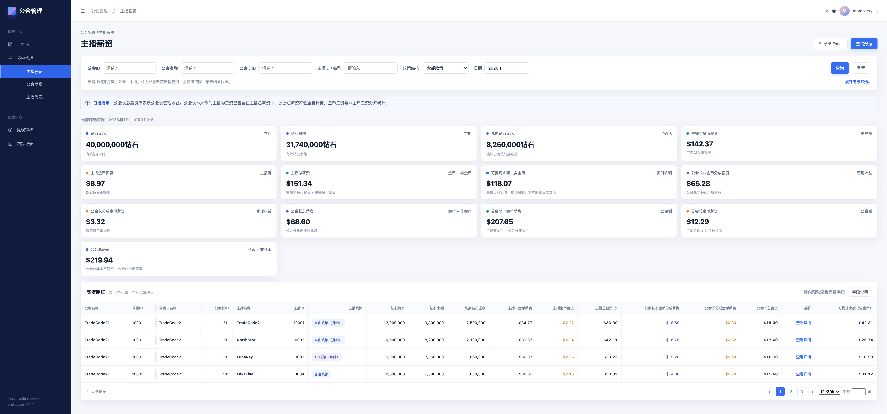
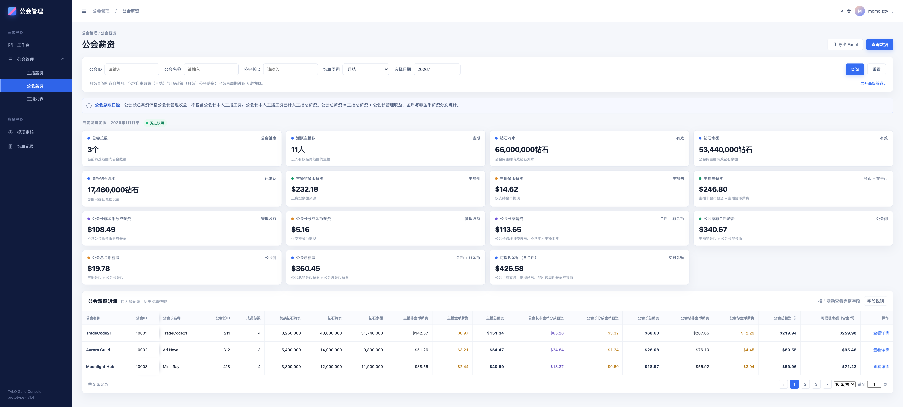

# 公会需求 1.4｜后台薪资需求文档 PRD

文档版本：V1.4  
适用页面：后台—主播薪资、后台—公会薪资

## 一、产品目标与范围

按主播、公会两个维度展示周期薪资，区分金币薪资、非金币薪资和当前实时可提现余额；支持筛选、汇总、排序、详情及导出。

| 页面 | 本次调整 |
|---|---|
| 主播薪资 | 汇总保留公会总薪资相关字段；列表删除公会总非金币薪资、公会总金币薪资、公会总薪资；新增可提现余额（含金币）并放在列表最右；主播总薪资支持升降序 |
| 公会薪资 | 保留公会总薪资相关字段；新增可提现余额（含金币）；公会总薪资支持升降序 |
| 两页共同 | 使用“非金币薪资”命名；取消预支、借支、待抵扣及对冲计算；不展示起始钻石余额、最终钻石余额、公会总薪资余额，也不使用这些字段反推工资 |

> 1.0 仅作为本次结构与写法参考，不恢复已删除业务。周结及政策算法承接 1.3 未上线设计；线上核验仍以已上线 1.0～1.2 和用户确认的 1.4 变更为准。

## 二、核心业务规则

### 2.1 结算口径

| 项目 | 规则 |
|---|---|
| 结算周期 | 月结按自然月；周结按 UTC+3 自然周，包含本周一 00:00、不含下周一 00:00，每周一 00:00 结算上一自然周 |
| 公会归属 | 按主播、周期、公会及归属时间段/快照区分记录；同一事件不得跨公会重复计入 |
| 数据读取 | 当前周期读取实时结算结果；已结束周期读取政策、归属、钻石输入、工资拆分均一致的结算快照，不按当前关系、政策或余额重算 |
| 金额单位 | 所有薪资及可提现余额以 USD 展示，金币薪资同样为美元金额；钻石字段展示数量 |
| 金额精度 | 沿用现有账务规则；月结/周结的精度、舍入时点和金币兑换取整需统一确认，不新增一套规则 |
| 公会长总薪资 | 两页均只表示公会长管理收益，不含本人主播工资；本人主播工资计入主播总薪资，公会总账各计一次 |

**记录归属与生命周期**

| 对象 | 记录区分方式 | 生命周期 |
|---|---|---|
| 主播结算记录 | 主播ID + 周期 + 公会归属快照 | 当前周期读取实时结果，已结束周期读取结算快照 |
| 公会结算记录 | 公会ID + 周期 + 结算快照版本 | 当前周期读取实时结果，已结束周期读取结算快照 |
| 工资项 | 工资项标识、归属对象、来源规则 | 逐项生成金额，拆分金币与非金币后汇总 |
| 公会归属快照 | 主播ID + 公会ID + 归属时间段 | 历史归属不被当前关系覆盖 |
| 余额池 | 账号 + 余额池类型 | 当前余额持续变化，不回写历史工资快照 |
| 结算快照 | 周期 + 对象 + 快照版本 | 冻结政策、归属、输入、工资项及结果，不按当前配置重算 |



### 2.2 薪资计算

**钻石输入**

- 非幸运礼物按 `1 金币 = 2 钻石`，幸运礼物按 `10 金币 = 2 钻石` 换算；按周期、归属、政策绑定排除冻结、拒付及无效流水。
- 有效钻石流水用于公会长管理收益；有效钻石余额用于主播工资，直接读取既有结算结果，两者不得互换，也不得用公会总余额代替逐主播计算。
- 兑换钻石流水仅汇总已确认兑换记录，用于对账，不作为工资基数或有效钻石余额的推算依据。

**自由政策（月结）**

```text
单个主播总薪资 = 有效钻石余额 × 政策分成比 ÷ 钻石折算美元比例 × 主播分成比例
单个主播贡献的公会长管理收益 = 有效钻石流水 × 政策分成比 ÷ 钻石折算美元比例 × 公会长分成比例
```

政策分成比、钻石折算美元比例、主播分成比例、公会长分成比例和金币工资比例均读取当期政策绑定快照。公会长兼任主播时，本人主播工资和管理收益分别生成工资项。

**自由政策（周结）**

使用相同模型，统计周期改为自然周。承接的周结参数为政策分成比 0.8、钻石折算美元比例 130000、主播分成比例 0.73、公会长分成比例 0.27、金币工资比例 0.2。

```text
单个主播周总薪资 = 有效钻石余额 × 0.8 ÷ 130000 × 0.73
单个主播贡献的公会长周管理收益 = 有效钻石流水 × 0.8 ÷ 130000 × 0.27
```

**TG政策（月结）/非自由政策**

1. 读取公会月度流水和当期政策绑定快照，命中任务/政策档位，取得基础薪资、目标值、超档步长、超档金额和拆分比例。
2. 主播底薪、主播 TG 奖励使用主播有效钻石余额；公会长分成使用主播有效钻石流水，分别形成对应计算基数。
3. 先判断超档并形成总工资基数，再按政策比例拆出主播底薪 X、主播 TG 奖励 Z、公会长分成 Y。

```text
超档增量 = 向下取整((实际值 - 当前档目标值) ÷ 超档步长) × 当前档超档金额
总工资基数 = 当前档基础薪资 + 超档增量
```

4. 有效天未达标等扣减沿用当期政策顺序；处理后再拆金币、非金币工资。页面读取最终结果，不新增扣减字段。
5. 列表以统一薪资字段承接不同政策结果，政策计算过程保留在结算快照和详情中，不混用不同政策的基数。

### 2.3 金币拆分与汇总

每笔主播工资项、公会长管理收益工资项分别拆分后再按角色、公会汇总，不先汇总总额再倒拆。金币工资比例读取该工资项对应的当期政策快照。

```text
工资项金币工资 = 工资项总额 × 金币工资比例
工资项非金币工资 = 工资项总额 × (1 - 金币工资比例)

主播非金币薪资 = 各主播工资项非金币部分之和
主播金币薪资 = 各主播工资项金币部分之和
主播总薪资 = 主播非金币薪资 + 主播金币薪资

公会长非金币分成薪资 = 各管理收益工资项非金币部分之和
公会长分成金币薪资 = 各管理收益工资项金币部分之和
公会长总薪资 = 公会长非金币分成薪资 + 公会长分成金币薪资

公会总非金币薪资 = 主播非金币薪资 + 公会长非金币分成薪资
公会总金币薪资 = 主播金币薪资 + 公会长分成金币薪资
公会总薪资 = 公会总非金币薪资 + 公会总金币薪资 = 主播总薪资 + 公会长总薪资
```

金币薪资字段只表示金币工资部分，非金币薪资字段不含金币，总薪资字段包含两者。金币工资进入金币工资余额池，只能提金币；非金币工资按既有工资型余额池出口规则使用。

### 2.4 可提现余额（含金币）

**主播维度**

```text
主播可提现余额（含金币）
= 当前个人薪资余额池可提现部分
+ 当前金币工资余额池可提现部分
+ 已实际入账且仍符合提现条件的转入薪资余额
```

直接读取当前账号余额池。个人薪资按既有规则判断现金、金币或转给公会长的出口；金币工资计入展示不代表允许现金提现。已提现、冻结、失败回滚未恢复、不可用或无可用提现出口的金额不计入，周期工资不得再次累计到转入余额。

**公会维度**

```text
公会可提现余额（含金币）
= 当前公会归属范围内可归因的主播实时可提现余额合计
+ 当前公会公会长管理收益对应的实时可提现余额
```

- 公会仅做实时汇总，不新增独立公会钱包。公会长本人主播余额计入主播成员侧，管理收益余额单独计入；同一余额池不得因多重身份或多公会重复统计。
- 转入薪资及跨公会余额的具体归属仍待确认，未能明确归因的余额不得猜测归属；上述汇总须以确认后的归属范围为准。
- 两页均标识“实时余额”；即使查询历史周期，也读取当前余额，不回写历史快照。该值可以大于、小于或不等于周期总薪资。

## 三、后台功能需求

### 3.1 主播薪资

#### 对应原型



**功能描述：** 按结算周期、公会、政策及主播查看主播工资、公会长分成与当前主播实时可提现余额。

#### 前置条件

- 已具备后台薪资数据查看权限，查询周期及政策范围已确定；权限规则见第四章。
- 当前周期已有实时结算结果，或历史周期已有对应结算快照；同周期多公会记录按各自归属快照分别展示。

#### 字段与数据来源

##### 筛选项

| 字段/操作 | 定义 | 处理规则 |
|---|---|---|
| 公会ID | 目标公会唯一编号 | 支持精确查询；为空不限制 |
| 公会名称 | 目标公会名称 | 支持模糊查询；为空不限制 |
| 公会长ID | 目标公会长账号ID | 按结算归属/当前关系查询 |
| 主播ID / 名称 | 目标主播账号ID或名称 | 支持主播级查询 |
| 政策结构 | 结算政策类型 | 枚举至少包括 `自由政策（月结）`、`自由政策（周结）`、`TG政策（月结）` |
| 日期 | 结算周期定位 | 月结显示自然月；周结显示 UTC+3 自然周；页面当前原型展示月结示例 |
| 所属大区 | 高级筛选 | 按当前后台已有大区口径筛选；不改变工资公式 |
| 结算状态 | 高级筛选 | 当前周期实时计算/已结算等状态沿用现有状态体系 |
| 数据视图 | 高级筛选 | 结算快照/实时数据；不得把两种数据源拼成一条结果 |
| 查询 | 执行查询 | 汇总与列表必须使用同一筛选条件、周期和数据源 |
| 重置 | 恢复默认筛选 | 清空输入，恢复默认周期和日期 |
| 导出 Excel | 导出当前结果 | 导出字段与当前查询结果同口径；记录导出人、时间、筛选条件和快照版本 |

##### 汇总字段

汇总范围为当前筛选命中的主播结算记录；周期金额采用同一数据源及快照版本，实时余额独立读取。表中金币工资比例按每笔工资项对应政策取值，先逐项拆分，再求和。

| 字段 | 业务定义 | 计算方式 / 取值规则 | 数据来源 |
|---|---|---|---|
| 钻石流水 | 当前筛选范围内主播有效钻石流水合计 | `Σ 有效钻石流水`；按周期、主播、公会归属、政策快照过滤 | 钻石流水结果/结算快照 |
| 钻石余额 | 当前筛选范围内主播有效钻石余额合计 | `Σ 有效钻石余额`；不使用起始/最终余额推导 | 有效余额结果/结算快照 |
| 兑换钻石流水 | 当前筛选范围内已确认兑换钻石合计 | `Σ 已确认兑换钻石记录`；只用于对账，不替代 `有效钻石余额` | 兑换记录 |
| 主播非金币薪资 | 筛选范围内主播工资项的非金币部分 | `Σ 主播工资项 × (1-金币工资比例)` | 主播结算明细 |
| 主播金币薪资 | 筛选范围内主播工资项的金币部分 | `Σ 主播工资项 × 金币工资比例` | 工资拆分明细 |
| 主播总薪资 | 筛选范围内主播应发总工资（含金币） | `主播非金币薪资 + 主播金币薪资` | 主播结算快照 |
| 可提现余额（含金币） | 当前主播实时可提现余额合计（含金币） | `Σ 当前主播可提现余额（含金币）`，不从本期工资反推 | 当前余额池 |
| 公会长非金币分成薪资 | 筛选范围内主播贡献的公会长管理收益非金币部分 | `Σ 公会长管理收益工资项 × (1-金币工资比例)` | 公会长收益明细 |
| 公会长分成金币薪资 | 筛选范围内主播贡献的公会长管理收益金币部分 | `Σ 公会长管理收益工资项 × 金币工资比例` | 工资拆分明细 |
| 公会长总薪资 | 筛选范围内公会长管理收益合计（含金币） | `公会长非金币分成薪资 + 公会长分成金币薪资` | 公会长收益快照 |
| 公会总非金币薪资 | 当前筛选范围的公会总非金币结果 | 页面汇总可展示，但不进入主播列表；`主播非金币薪资 + 公会长非金币分成薪资` | 公会汇总快照 |
| 公会总金币薪资 | 当前筛选范围的公会总金币结果 | 页面汇总可展示，但不进入主播列表；`主播金币薪资 + 公会长分成金币薪资` | 公会汇总快照 |
| 公会总薪资 | 当前筛选范围的公会总工资（含金币） | 页面汇总可展示，但不进入主播列表；`主播总薪资 + 公会长总薪资` | 公会汇总快照 |

##### 列表字段

按以下顺序使用单层完整表头，不增加父级分组；公会总薪资相关字段仅保留在汇总区，可提现余额位于列表最右。

| 字段 | 业务定义 | 计算方式 / 取值规则 | 数据来源 |
|---|---|---|---|
| 公会名称 | 当前记录所属公会名称 | 从该记录的公会归属快照读取 | 公会资料/归属快照 |
| 公会ID | 当前记录所属公会编号 | 与公会名称同一归属快照 | 公会资料/归属快照 |
| 公会长名称 | 当前记录所属公会长名称 | 读取该周期的公会长关系快照 | 关系快照/用户资料 |
| 公会长ID | 当前记录所属公会长ID | 读取该周期的公会长关系快照 | 关系快照 |
| 主播名称 | 被结算主播名称 | 直接读取主播资料；不参与计算 | 用户资料 |
| 主播ID | 被结算主播账号ID | 直接读取主播资料；不参与计算 | 用户资料 |
| 主播政策 | 主播本期结算采用的政策 | 读取政策绑定快照，展示完整政策名称 | 政策绑定快照 |
| 钻石流水 | 当前主播本期有效流水 | `有效钻石流水` | 钻石流水结果 |
| 钻石余额 | 当前主播本期有效余额 | `有效钻石余额`；不等同起始/最终余额 | 有效余额结果 |
| 兑换钻石流水 | 当前主播本期已确认兑换钻石 | `Σ 已确认兑换记录` | 兑换记录 |
| 主播非金币薪资 | 当前主播工资项非金币部分 | `主播总工资项 × (1-金币工资比例)` | 工资拆分结果 |
| 主播金币薪资 | 当前主播工资项金币部分 | `主播总工资项 × 金币工资比例` | 工资拆分结果 |
| 主播总薪资 | 当前主播本期总工资（含金币） | `主播非金币薪资 + 主播金币薪资` | 主播结算快照 |
| 公会长非金币分成薪资 | 当前主播贡献的公会长管理收益非金币部分 | `该主播贡献的公会长工资项 × (1-金币工资比例)` | 公会长收益明细 |
| 公会长分成金币薪资 | 当前主播贡献的公会长管理收益金币部分 | `该主播贡献的公会长工资项 × 金币工资比例` | 工资拆分结果 |
| 公会长总薪资 | 当前主播对应的公会长管理收益合计（含金币） | `公会长非金币分成薪资 + 公会长分成金币薪资`；不含公会长本人主播工资 | 公会长收益快照 |
| 操作 | 进入该主播该条归属快照的详情 | 查看工资拆分、钻石和快照信息；不改写结果 | 页面操作 |
| 可提现余额（含金币） | 当前主播实时可提现余额（含金币） | 直接读取当前余额池汇总；放在列表最右，不与本期工资混列计算 | 实时余额池 |

##### 详情区块

展示主体资料、政策、周期、钻石三项、主播薪资三项、公会长分成薪资三项及结算快照版本/读取状态；政策计算与拆分明细按本记录读取，不混入其他公会记录。注明公会长总薪资仅为管理收益。详情若展示可提现余额，必须标识实时，其展示范围待确认。

#### 交互逻辑

1. **查询与筛选：** 输入条件后点击查询；展开高级筛选可设置所属大区、结算状态及数据视图。仅选月结政策时按自然月查询，自由政策（月结）与 TG政策（月结）可按既有规则一起查询；选择自由政策（周结）时改用 UTC+3 自然周，不混入月结政策。
2. **重置：** 清空筛选输入，恢复默认周期、日期并清除排序；查询和导出的共同读取规则见第四章。
3. **排序：** 点击“主播总薪资”右侧 `▲/▼`，按含金币的周期总薪资升序/降序；再次点击当前方向取消排序，恢复默认顺序。同金额保持稳定顺序，次级字段待确认；排序不改写汇总、快照、余额或导出口径。
4. **详情：** 点击操作列打开所选主播、所选归属记录的详情抽屉；展示内容见“详情区块”。
5. **导出 Excel：** 按当前筛选、周期、数据权限导出列表及关键快照字段，记录导出人、时间、筛选条件和快照版本。不得把公会总薪资重复写入每条主播记录；旧格式仍带公会总账时，需明确为公会级汇总字段。

#### 系统后台核心逻辑

- 钻石输入、政策计算及金币拆分按第二章执行；总览按筛选范围汇总，详情只读取被点击行的结果，不以页面显示值重新计算。
- 当前周期和历史周期不得混用金额来源；主播、公会、公会长及政策按该条记录归属读取，不因后续转会、离会或政策变更覆盖历史。

#### 边界情况

| 场景 | 处理规则 |
|---|---|
| 同周期跨多个公会 | 按公会归属快照拆成多条记录；工资按各归属范围累计，详情只看当前记录，不跨公会重复计入 |
| 月结、周结政策混选 | 不进入查询，不混算；页面禁用、自动清空或提交提示的具体方式待确认 |
| 仅有非金币工资 | 金币薪资为 0，主播总薪资等于非金币薪资；实时可提现余额仍独立读取 |
| 公会长本人也是主播 | 本人主播工资进入主播总薪资；本行公会长总薪资仅为该主播贡献的管理收益，不与本人主播工资重复叠加 |

### 3.2 公会薪资

#### 对应原型



**功能描述：** 按公会查看周期内成员规模、钻石、主播工资、公会长管理收益、公会总薪资及当前实时可提现余额。

#### 前置条件

- 已具备后台公会薪资查看权限，结算周期及政策范围已确定；权限规则见第四章。
- 汇总、列表、详情使用同周期、同数据源的结算结果；历史成员及公会长关系读取对应快照。

#### 字段与数据来源

##### 筛选项

| 字段/操作 | 定义 | 处理规则 |
|---|---|---|
| 公会ID | 目标公会唯一编号 | 支持精确查询 |
| 公会名称 | 目标公会名称 | 支持模糊查询 |
| 公会长ID | 目标公会长账号ID | 按当前/周期关系快照筛选 |
| 结算周期 | 月结或周结 | 默认月结；周结只查询自由政策（周结） |
| 选择日期 | 查询周期 | 月结选择自然月；周结选择 UTC+3 自然周 |
| 所属大区 | 高级筛选 | 仅改变查询范围，不改变公式 |
| 结算状态 | 高级筛选 | 区分已结算快照和当前实时结果 |
| 数据来源 | 高级筛选 | 结算快照/当前实时数据；同一结果禁止跨来源拼接 |
| 查询 | 执行公会查询 | 汇总、列表、详情、导出使用相同周期和数据源 |
| 重置 | 恢复默认筛选 | 恢复月结和默认日期 |
| 导出 Excel | 导出公会总账 | 导出范围和页面查询一致；记录导出人、时间、筛选条件、快照版本 |

##### 汇总字段

汇总当前筛选的目标公会；周期金额读取同一快照版本，实时可提现余额按 2.4 单独汇总。

| 字段 | 业务定义 | 计算方式 / 取值规则 | 数据来源 |
|---|---|---|---|
| 公会总数 | 当前筛选结果中的公会数量 | 去重统计 `公会ID`；同一周期同一快照只计一次 | 查询结果/公会资料 |
| 活跃主播数 | 当前周期进入有效结算范围的主播数量 | 对主播结算记录按主播归属快照去重统计；不使用当前成员数覆盖历史周期 | 主播结算明细/周期快照 |
| 钻石流水 | 所有目标公会内主播有效流水合计 | `Σ 有效钻石流水` | 钻石流水结果/结算快照 |
| 钻石余额 | 所有目标公会内主播有效余额合计 | `Σ 有效钻石余额` | 有效余额结果/结算快照 |
| 兑换钻石流水 | 目标公会已确认兑换钻石合计 | `Σ 已确认兑换钻石记录` | 兑换记录 |
| 主播非金币薪资 | 目标公会主播工资非金币合计 | `Σ 主播工资项非金币部分` | 主播结算明细 |
| 主播金币薪资 | 目标公会主播工资金币合计 | `Σ 主播工资项金币部分` | 工资拆分明细 |
| 主播总薪资 | 目标公会主播侧总工资（含金币） | `主播非金币薪资 + 主播金币薪资` | 主播结算快照 |
| 公会长非金币分成薪资 | 目标公会管理收益非金币合计 | `Σ 公会长管理收益工资项非金币部分` | 公会长收益明细 |
| 公会长分成金币薪资 | 目标公会管理收益金币合计 | `Σ 公会长管理收益工资项金币部分` | 工资拆分明细 |
| 公会长总薪资 | 目标公会管理收益合计（含金币） | `公会长非金币分成薪资 + 公会长分成金币薪资` | 公会长收益快照 |
| 公会总非金币薪资 | 目标公会总工资非金币合计 | `主播非金币薪资 + 公会长非金币分成薪资` | 公会汇总快照 |
| 公会总金币薪资 | 目标公会总工资金币合计 | `主播金币薪资 + 公会长分成金币薪资` | 公会汇总快照 |
| 公会总薪资 | 目标公会工资总盘子（含金币） | `公会总非金币薪资 + 公会总金币薪资`；等于主播总薪资 + 公会长总薪资 | 公会结算快照 |
| 可提现余额（含金币） | 目标公会当前实时可提现余额合计（含金币） | 按 2.4 公会维度规则汇总当前余额池；不从公会总薪资推导 | 当前余额池 |

##### 列表字段

按以下顺序使用单层完整表头；各薪资字段按第二章先逐工资项计算、拆分，再按公会汇总。

| 字段 | 业务定义 | 计算方式 / 取值规则 | 数据来源 |
|---|---|---|---|
| 公会名称 | 被查询公会名称 | 直接读取；不参与金额计算 | 公会资料 |
| 公会ID | 被查询公会唯一编号 | 直接读取；不参与金额计算 | 公会资料 |
| 公会长名称 | 当前/周期公会长名称 | 按查询状态读取当前关系或历史关系快照 | 关系快照/用户资料 |
| 公会长ID | 当前/周期公会长账号ID | 与公会长名称同源 | 关系快照 |
| 成员总数 | 公会成员数量 | 当前周期实时结果按当前成员口径；已结束周期按历史快照成员范围 | 成员关系/周期快照 |
| 兑换钻石流水 | 公会周期已确认兑换钻石 | `Σ 公会内主播已确认兑换记录` | 兑换记录 |
| 钻石流水 | 公会周期有效钻石流水 | `Σ 公会内主播 有效钻石流水` | 钻石流水结果 |
| 钻石余额 | 公会周期有效钻石余额 | `Σ 公会内主播 有效钻石余额`；不使用起始/最终余额 | 有效余额结果 |
| 主播非金币薪资 | 公会主播工资非金币合计 | `Σ 主播工资项非金币部分` | 工资拆分结果 |
| 主播金币薪资 | 公会主播工资金币合计 | `Σ 主播工资项金币部分` | 工资拆分结果 |
| 主播总薪资 | 公会主播侧总工资（含金币） | `主播非金币薪资 + 主播金币薪资` | 主播结算快照 |
| 公会长非金币分成薪资 | 公会长管理收益非金币合计 | `Σ 公会长工资项非金币部分` | 公会长收益明细 |
| 公会长分成金币薪资 | 公会长管理收益金币合计 | `Σ 公会长工资项金币部分` | 工资拆分结果 |
| 公会长总薪资 | 公会长管理收益合计（含金币） | `公会长非金币分成薪资 + 公会长分成金币薪资`；不含本人主播工资 | 公会长收益快照 |
| 公会总非金币薪资 | 公会总工资非金币合计 | `主播非金币薪资 + 公会长非金币分成薪资` | 公会结算快照 |
| 公会总金币薪资 | 公会总工资金币合计 | `主播金币薪资 + 公会长分成金币薪资` | 公会结算快照 |
| 公会总薪资 | 公会总工资盘子（含金币） | `公会总非金币薪资 + 公会总金币薪资` | 公会结算快照 |
| 可提现余额（含金币） | 公会当前实时可提现余额合计（含金币） | 按当前余额池实时汇总；不使用所选周期公会总薪资推导 | 当前余额池 |
| 操作 | 查看公会结算详情 | 读取该公会该周期的结算结果；不触发重算 | 页面操作 |

##### 详情区块

展示公会/公会长资料、成员总数、周期、钻石三项、主播薪资三项、公会长分成薪资三项、公会总薪资三项及结算快照版本/实时数据状态；历史金额直接读取对应公会结算快照。可提现余额若展示须标识实时，具体详情展示范围待确认；注明公会长本人主播工资不重复计入管理收益。

#### 交互逻辑

1. **查询与周期切换：** 默认月结，选择自然月后查询自由政策（月结）及 TG政策（月结）；切换周结后按 UTC+3 自然周查询，仅包含自由政策（周结）。展开高级筛选可设置所属大区、结算状态及数据来源。
2. **重置：** 恢复月结、默认日期与默认筛选，并清除排序。
3. **排序：** 点击“公会总薪资”右侧 `▲/▼`，按含金币的周期总薪资升序/降序；再次点击当前方向取消排序。同金额保持稳定顺序，次级字段待确认；不改变汇总、快照、余额或导出口径。
4. **详情：** 点击操作列打开该公会该周期详情；展示内容见“详情区块”。
5. **导出 Excel：** 导出当前筛选范围内公会列表、同口径汇总及关键快照字段，记录导出人、时间、筛选条件和快照版本。周结只导出自由政策（周结）；月结按月结政策范围导出。

#### 系统后台核心逻辑

- 先逐主播、逐管理收益工资项完成政策计算与拆分，再按同一公会、周期、快照汇总；公会总薪资等于主播总薪资加公会长管理收益。
- 列表成员总数和汇总活跃主播数各按字段定义统计，不互相替代；公会总数按公会ID去重。
- 公会实时余额只按明确的归属范围汇总，不从公会总薪资反推，不建立新的公会钱包。

#### 边界情况

| 场景 | 处理规则 |
|---|---|
| 历史公会长或成员已变化 | 薪资与成员范围读取历史快照，不以当前关系覆盖 |
| 公会长兼任主播 | 本人主播工资已经计入主播总薪资，公会长总薪资只计管理收益，公会总账不重复计算 |
| 部分余额无法归因公会 | 保留待确认，不使用页面金额猜测归属，也不跨公会重复累计 |
| 周期工资为 0、实时余额仍有钱 | 两者分别展示，不互相覆盖、不自动修正 |

## 四、通用交互与异常

### 4.1 查询与导出

- 查询先校验周期和政策组合，再确定当前实时结果或历史结算快照；总览、列表、详情及导出使用同一查询范围和数据源。实时可提现余额按 2.4 独立读取，不混充周期工资。
- 页面查询、排序、详情和导出只读，不触发结算、生成快照、入账或修改余额；历史导出读取历史快照，当前周期导出读取当前实时结果。
- 已确认快照不因后续提现、转账、冻结、失败回滚等资金变动而回写；结算失败/重试须关联原记录和已入账结果，不重复生成工资或重复入账。
- 旧导出的已删除字段是否同步移除见待确认表，不得因此在页面恢复旧字段。

### 4.2 状态与异常

| 场景 | 页面处理 |
|---|---|
| 当前周期未结束 | 显示实时结算结果，不能标为已结算；不生成历史快照、不入账 |
| 历史周期已结算 | 读取该周期结算快照；可提现余额另读当前值并标识实时 |
| 结算中、失败或重试 | 沿用既有结算状态，不把未完成结果当成正式结算 |
| 查询无匹配记录 | 显示空状态，汇总按现有零值/空值规则展示，清除上一查询结果 |
| 快照缺失、版本不一致或无法对账 | 标记数据异常，不拼接不同来源/版本，不作为正常结算展示 |
| 兑换钻石与有效余额不一致 | 各自按记录展示，不用二者差额替代工资基数 |
| 实时余额与周期工资不同 | 允许存在差异，不自动修正；实时余额须能追溯到当前余额池明细 |

### 4.3 权限

财务、运营按既有后台数据权限查询、排序、查看详情和导出，不允许通过本页修改结算或余额。无权限用户不得看到薪资页面或金额，也不得越权读取其他公会。客户端公会长、管理员身份不自动获得后台薪资查看或导出权限；1.1/1.2 角色增量不改变后台薪资公式和授权范围。

## 五、系统消息需求

### 13.1 范围与版本关系

本章迁移自《公会1.3增量需求文档》的“系统消息补充”，作为1.4现行系统消息需求；承接已确认的入会、工资、提现、管理员角色及周结政策规则。不将下述文案视为历史版本已经实现的消息，不新增Toast、页面弹窗、审核权限或资金状态。

月结通知覆盖自由政策（月结）和TG政策（月结）；周结通知仅覆盖自由政策（周结）。提现申请人包括主播、公会长；管理员提现本人主播工资时按申请人身份接收。

### 13.2 消息文案与触发条件

#### 申请与关系

| 接收角色 | 场景 | 消息标题 | 消息正文 | 发送条件 |
|---|---|---|---|---|
| 申请主播 | 入会通过 | 入会申请已通过 | 你申请加入公会「{公会名称}」的申请已通过，现已成为该公会成员。 | 入会审核通过且成员关系建立成功 |
| 申请主播 | 入会拒绝 | 入会申请未通过 | 你申请加入公会「{公会名称}」的申请未通过。 | 申请拒绝结果确认 |
| 申请主播 | 入会超时 | 入会申请已超时 | 你申请加入公会「{公会名称}」的申请因超时未处理，已被系统自动拒绝。 | 申请实际完成超时自动拒绝 |
| 申请主播 | 退会通过 | 退会申请已通过 | 你退出公会「{公会名称}」的申请已通过。 | 退会申请通过结果确认；不据此宣称关系已解除或工资已到账 |
| 申请主播 | 退会拒绝 | 退会申请未通过 | 你退出公会「{公会名称}」的申请未通过。 | 退会申请拒绝结果确认 |
| 公会长、管理员 | 收到入会申请 | 新的入会申请 | 主播「{主播昵称}」（ID：{主播ID}）申请加入公会「{公会名称}」，请查看并处理。 | 申请创建成功；接收范围及退会权限边界见本章“待确认边界” |
| 公会长、管理员 | 收到退会申请 | 新的退会申请 | 主播「{主播昵称}」（ID：{主播ID}）申请退出公会「{公会名称}」，请查看并处理。 | 申请创建成功；接收范围及退会权限边界见本章“待确认边界” |
| 被移出的主播 | 被移出公会 | 公会成员关系已解除 | 你已被移出公会「{公会名称}」。 | 成员关系实际解除；不与主动退会通过消息混用 |

#### 角色变更

| 接收角色 | 场景 | 消息标题 | 消息正文 | 发送条件 |
|---|---|---|---|---|
| 被任命成员 | 管理员任命成功 | 已设为公会管理员 | 你已被设为公会「{公会名称}」的管理员。 | 管理员身份设置成功 |
| 被取消身份成员 | 管理员身份取消 | 公会管理员身份已取消 | 你在公会「{公会名称}」的管理员身份已取消。 | 取消管理员操作成功；不因退会或移除重复发送本条 |

#### 工资结算

| 接收角色 | 场景 | 消息标题 | 消息正文 | 发送条件 |
|---|---|---|---|---|
| 主播 | 月工资结算完成 | 月工资结算完成 | 你在公会「{公会名称}」的{结算月份}工资已结算，本期总薪资为{总薪资} USD。 | 对应周期实际结算成功 |
| 公会长 | 月工资结算完成 | 月工资结算完成 | 你在公会「{公会名称}」的{结算月份}工资已结算，公会长总薪资为{个人薪资合计}$。<br>其中：<br>作为主播工资：{本人主播工资}$<br>公会长收益：{公会长收益}$ | 对应周期个人工资结果结算成功；在同一消息内展示合计和两项明细 |
| 管理员 | 公会月工资结算完成 | 公会月工资结算完成 | 公会「{公会名称}」的{结算月份}工资已结算。 | 对应公会周期实际结算成功；不展示公会金额 |
| 主播 | 周工资结算完成 | 周工资结算完成 | 你在公会「{公会名称}」的{周开始日期}至{周结束日期}工资已结算，本期总薪资为{总薪资} USD。 | 对应周期实际结算成功 |
| 公会长 | 周工资结算完成 | 周工资结算完成 | 你在公会「{公会名称}」的{周开始日期}至{周结束日期}工资已结算，公会长总薪资为{个人薪资合计}$。<br>其中：<br>作为主播工资：{本人主播工资}$<br>公会长收益：{公会长收益}$ | 对应周期个人工资结果结算成功；在同一消息内展示合计和两项明细 |
| 管理员 | 公会周工资结算完成 | 公会周工资结算完成 | 公会「{公会名称}」的{周开始日期}至{周结束日期}工资已结算。 | 对应公会周期实际结算成功；不展示公会金额 |

#### 工资转账

| 接收角色 | 场景 | 消息标题 | 消息正文 | 发送条件 |
|---|---|---|---|---|
| 转出主播 | 工资转账成功 | 工资转账成功 | 你的{转账金额} USD工资已成功转入公会长「{公会长昵称}」（ID：{公会长ID}）的账户。 | 审核通过且收款公会长账户实际入账成功 |
| 收款公会长 | 主播工资转入到账 | 主播工资转入到账 | 主播「{主播昵称}」（ID：{主播ID}）向你的账户转入了{转账金额} USD工资，已到账。 | 审核通过且收款公会长账户实际入账成功；不额外通知管理员 |

#### 提现金币

| 接收角色 | 场景 | 消息标题 | 消息正文 | 发送条件 |
|---|---|---|---|---|
| 提现申请人 | 金币实际到账 | 提现金币到账 | 你申请提现的{提现金额} USD工资已成功兑换为{实际到账金币数}金币，金币已到账。 | 实际金币发放成功；金币工资全部提现与普通工资提现金币共用模板，金额读取各自实际结果 |

#### 提现现金

| 接收角色 | 场景 | 消息标题 | 消息正文 | 发送条件 |
|---|---|---|---|---|
| 提现申请人 | 提交成功，待审核 | 工资提现申请已提交 | 你的工资提现申请已提交，等待审核。<br>申请金额：{提现金额} USD<br>提现方式：{提现方式}<br>提现单号：{提现单号} | 申请创建成功且金额冻结成功 |
| 提现申请人 | 审核通过，待打款 | 工资提现审核已通过 | 你的工资提现申请已通过审核，等待打款。<br>申请金额：{提现金额} USD<br>提现方式：{提现方式}<br>提现单号：{提现单号} | 审核通过并进入待打款状态 |
| 提现申请人 | 审核拒绝 | 工资提现申请未通过 | 你的工资提现申请未通过审核。<br>申请金额：{提现金额} USD<br>拒绝原因：{拒绝原因}<br>提现单号：{提现单号} | 拒绝结果确认；仅冻结金额已释放时追加“本次申请冻结的金额已释放。” |
| 提现申请人 | 打款成功，但无法确认实际到账 | 工资提现已打款 | 你的工资提现已打款，请留意到账情况。<br>申请金额：{提现金额} USD<br>实际打款金额：{打款金额} {打款币种}<br>提现方式：{提现方式}<br>提现单号：{提现单号} | 渠道或财务确认打款成功；不写已到账 |

### 13.3 金额与变量口径

- 所有金额、身份、昵称、ID、公会及周期取自对应业务结果，不用当前余额或当前配置反推历史金额；消息不改变工资计算、余额池和审核规则。
- 主播总薪资不拆分金币工资和非金币工资。
- 公会长消息中的“公会长总薪资”＝本人作为主播工资＋公会长收益；两项在同一消息内列出，不包含其他主播工资或主播转入金额。此处为通知展示口径，不修改本 PRD 2.2、3.1 和 3.2 报表中“公会长总薪资仅指管理收益”的既有定义。
- 公会长个人合计仅组合本次对应周期的实际结算结果，不跨月、周或其他公会拼接，不挪用另一周期金额。
- 管理员收到的公会结算通知不展示金额；其本人主播工资另按主播模板接收。公会长本人主播工资已包含在公会长个人结算消息时，不对同一工资结果再发一条主播结算消息。
- 金币提现读取实际发放数量，不在消息中按当前比例重新换算；现金打款金额及币种读取实际打款结果，不能用申请美元金额冒充实际打款金额。
- 现金提现所有消息不展示收款账户、收款人或其他收款信息。提现方式、提现单号和用户可见拒绝原因按表展示。

### 13.4 通知边界

- 同一业务结果、同一接收人、同一消息场景只发送一次；重复审核、结算重试和重复回调不得重复发消息。通知重试不重新结算、转账或发放资产。
- 申请通过、关系解除、审核通过、实际入账及打款成功分别按真实完成结果触发，不能相互替代。
- 现金提现本次仅包含提交待审核、审核通过待打款、审核拒绝、打款成功四个场景；不增加确认到账、打款失败、失败回滚通知，也不因此删除原资金失败处理。
- 本次不增加政策变更、结算延迟、工资更正、退会超时，以及工资转给公会长的拒绝或失败通知。
- 本章只定义系统消息，不扩展为短信或外部推送，也不新增消息跳转入口。

### 13.5 待确认边界

| 事项 | 当前范围与待确认内容 |
|---|---|
| 退会审批 | 退会申请通知及通过/拒绝结果消息已纳入范围；历史材料未完整定义审核流程及管理员退会审批权限，不得因“请查看并处理”文案授予新权限，需补齐后接入对应结果事件 |
| 管理侧接收范围 | 入会、退会申请通知的角色范围为公会长和管理员；是否通知全部管理员以及具体接收人员分配规则待确认，不擅自增加广播或轮派规则 |

## 六、待确认问题

| 编号 | 问题 | 当前已知事实 | 影响 |
|---|---|---|---|
| P1-01 | 月结与周结混选时页面采用禁用、自动清空还是查询时提示 | 1.3 只确认该组合不支持，当前原型分别用政策结构/结算周期承载 | 影响筛选控件交互 |
| P1-02 | 月结/周结金额的精度和舍入时点 | 现有材料存在比例和公式，但未统一定义 1.4 页面精度 | 影响页面、导出和账务尾差 |
| P1-03 | 可提现余额含金币的实时余额池归属 | 用户确认展示主播/公会当前实时可提现余额；公会维度需要明确转入余额和公会长管理收益余额的归属规则 | 影响公会实时余额汇总和跨公会场景 |
| P1-04 | 同金额排序的确定性次级字段 | 当前需求只确认升序/降序按钮 | 影响多次查询的列表稳定性 |
| P1-05 | 旧版导出是否同步删除预支、起始/最终余额、公会总薪资余额 | 当前页面明确删除；旧导出结构需单独核对 | 影响导出字段兼容 |
| P1-06 | 当前周期详情是否同时展示实时可提现余额 | 当前两个原型列表已展示；详情中是否展示由页面交互统一 | 影响详情字段范围 |
